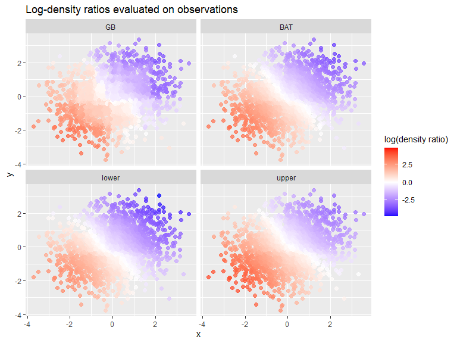
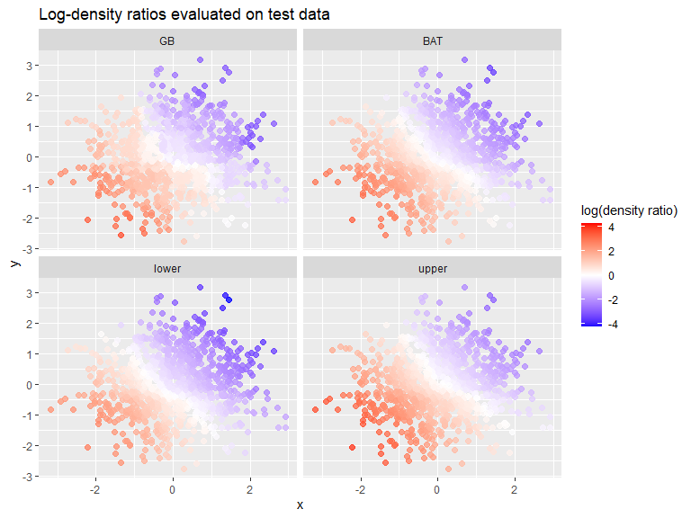

# BATTS: Vignette

BATTS implements the boosting and Bayesian additive tree methods from
Awaya, Xu, and Ma (2025) for two-sample comparison through density ratio
estimation.

Paper: [Two-sample comparison through additive tree models for density
ratios](https://arxiv.org/abs/2508.03059)

## Install BATTS

``` r
library(devtools)
install_github("nawaya040/BATTS")
```

## Main functions

BATTS exposes three main user-facing functions:

- `boots()` fits the boosting estimator for the density ratio.
- `batts()` fits the Bayesian additive tree model and can return
  posterior samples for uncertainty quantification.
- `eval_balance_weight()` evaluates fitted models on new points.

The functions return the square root of the density ratio, so the
example below converts outputs to log-density ratios for plotting and
interpretation.

## Worked example

The full example script is included in [`example.R`](example.R). The
code below reproduces the main workflow.

``` r
library(mvtnorm)
library(ggplot2)
library(BATTS)

balance_to_log_ratio = function(x) {
  log(x) * 2
}

calc_quantiles = function(x) {
  quantile(x, probs = c(0.025, 0.975))
}
```

### Generate a two-sample data set

``` r
set.seed(1)

n0 = 1000
n1 = 1000

X0 = rmvnorm(n0, mean = c(-0.5, -0.5))
X1 = rmvnorm(n1, mean = c(0.5, 0.5))

data = rbind(X0, X1)
group_labels = c(rep(0, n0), rep(1, n1))
```

### Boosting fit

``` r
result_boosting = boots(
  data = data,
  group_labels = group_labels,
  num_trees_max = 500,
  K_CV = 5,
  max_resol = 4,
  learn_rate = 0.01,
  n_bins = 32,
  margin_scale = 0.1,
  use_gradient = TRUE,
  quiet = TRUE
)

log_ratio_boosting =
  balance_to_log_ratio(result_boosting$balance_weight_boosting_data)
```

### Bayesian additive tree fit

``` r
result_BAT = batts(
  data = data,
  group_labels = group_labels,
  num_trees = 200,
  lambda_0 = 5,
  margin_scale = 0.25,
  size_burnin = 500,
  size_backfitting = 500,
  output_BART_ensembles = TRUE,
  quiet = TRUE
)

log_ratio_BAT = balance_to_log_ratio(result_BAT$balance_weight_BART_data)
log_ratio_BAT_mean = rowMeans(log_ratio_BAT)
log_ratio_BAT_quantiles = apply(log_ratio_BAT, 1, calc_quantiles)
```

### Plot fitted log-density ratios on the observed data

``` r
methods = c("GB", "BAT", "lower", "upper")

ratio_df = data.frame(
  x = rep(data[, 1], 4),
  y = rep(data[, 2], 4),
  log_ratio = c(
    log_ratio_boosting,
    log_ratio_BAT_mean,
    log_ratio_BAT_quantiles[1, ],
    log_ratio_BAT_quantiles[2, ]
  ),
  method = factor(rep(methods, each = nrow(data)), levels = methods)
)

max_abs = max(abs(ratio_df$log_ratio))

ggplot(ratio_df, aes(x = x, y = y, color = log_ratio)) +
  geom_point(size = 2, alpha = 0.75) +
  scale_color_gradientn(
    colours = c("blue", "white", "red"),
    values = scales::rescale(c(-max_abs, 0, max_abs)),
    limits = c(-max_abs, max_abs),
    oob = scales::squish
  ) +
  facet_wrap(~method, nrow = 2) +
  labs(color = "log(density ratio)") +
  ggtitle("Log-density ratios evaluated on observations")
```

<!-- -->

### Evaluate on new points

``` r
eval_points = rmvnorm(1000, mean = c(0, 0), sigma = diag(2))

eval_boosting = eval_balance_weight(
  list_result = result_boosting,
  eval_points = eval_points,
  is_Bayes = FALSE
)

log_ratio_eval_boosting =
  balance_to_log_ratio(eval_boosting$balancing_weight_boosting)

eval_BAT = eval_balance_weight(
  list_result = result_BAT,
  eval_points = eval_points,
  is_Bayes = TRUE
)

log_ratio_eval_BAT = balance_to_log_ratio(eval_BAT$balancing_weight_BART)
log_ratio_eval_BAT_mean = rowMeans(log_ratio_eval_BAT)
log_ratio_eval_BAT_quantiles = apply(log_ratio_eval_BAT, 1, calc_quantiles)
```

### Plot evaluated log-density ratios on new points

``` r
methods = c("GB", "BAT", "lower", "upper")

ratio_eval_df = data.frame(
  x = rep(eval_points[, 1], 4),
  y = rep(eval_points[, 2], 4),
  log_ratio = c(
    log_ratio_eval_boosting,
    log_ratio_eval_BAT_mean,
    log_ratio_eval_BAT_quantiles[1, ],
    log_ratio_eval_BAT_quantiles[2, ]
  ),
  method = factor(rep(methods, each = nrow(eval_points)), levels = methods)
)

max_abs = max(abs(ratio_eval_df$log_ratio))

ggplot(ratio_eval_df, aes(x = x, y = y, color = log_ratio)) +
  geom_point(size = 2, alpha = 0.75) +
  scale_color_gradientn(
    colours = c("blue", "white", "red"),
    values = scales::rescale(c(-max_abs, 0, max_abs)),
    limits = c(-max_abs, max_abs),
    oob = scales::squish
  ) +
  facet_wrap(~method, nrow = 2) +
  labs(color = "log(density ratio)") +
  ggtitle("Log-density ratios evaluated on test data")
```

<!-- -->

## Reference

Awaya, N., Xu, Y., and Ma, L. (2025). [Two-sample comparison through
additive tree models for density
ratios](https://arxiv.org/abs/2508.03059).
